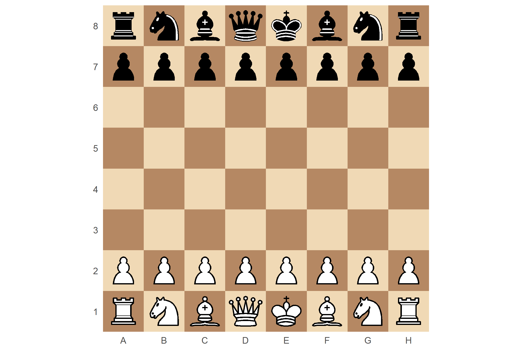
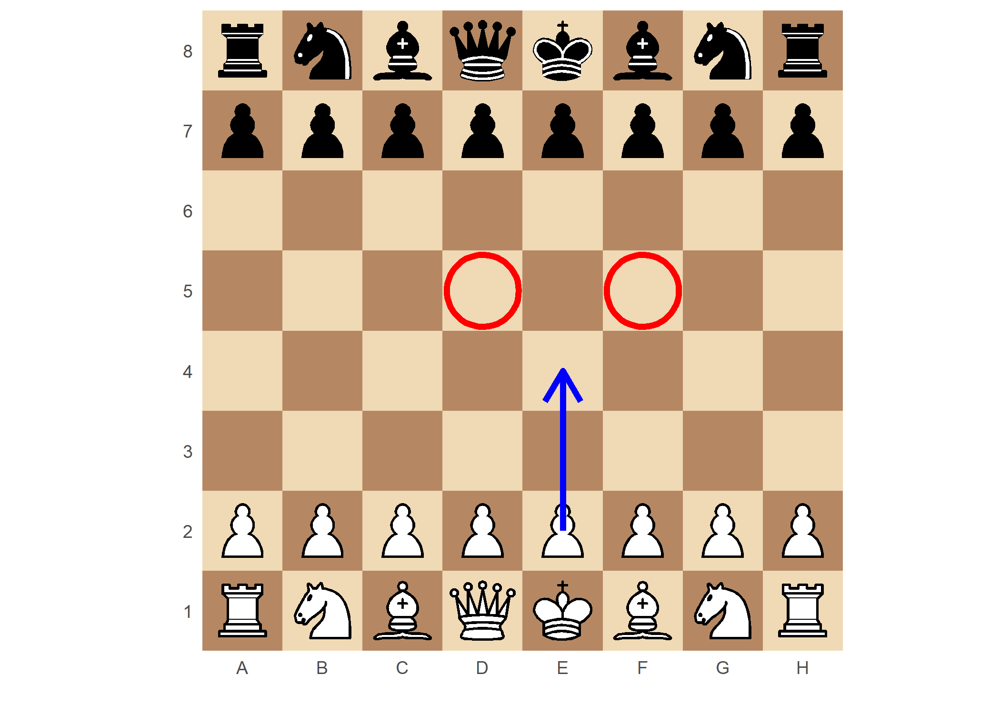
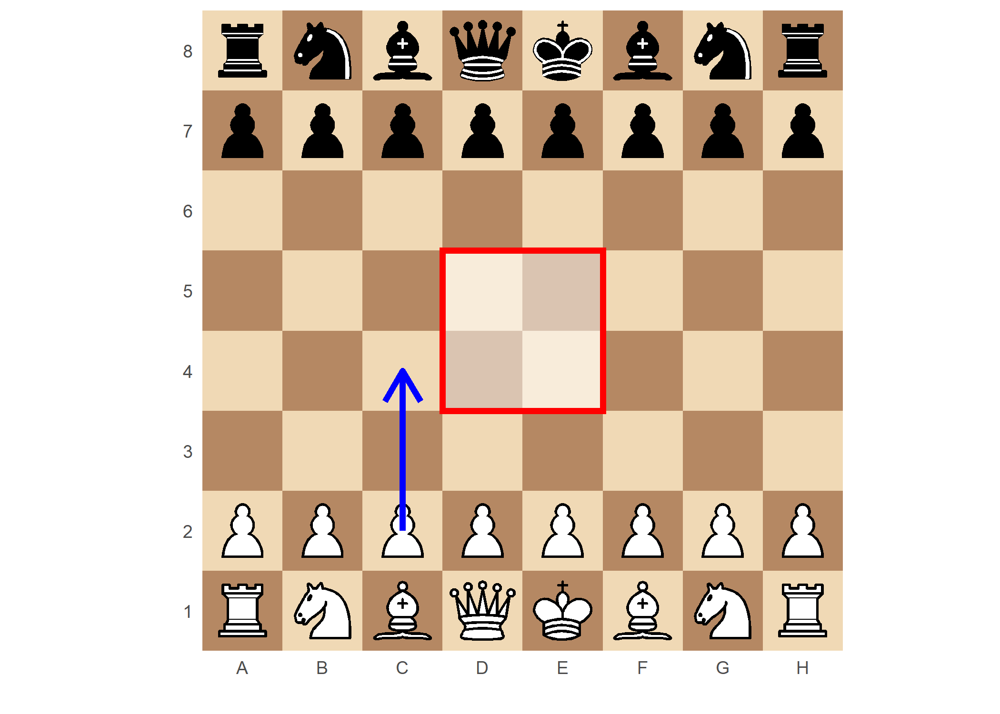
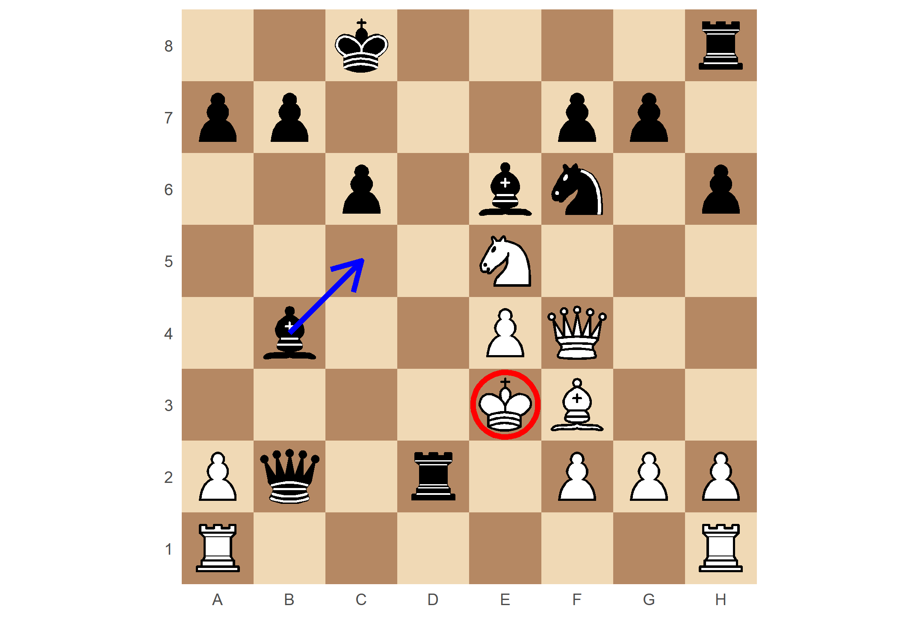
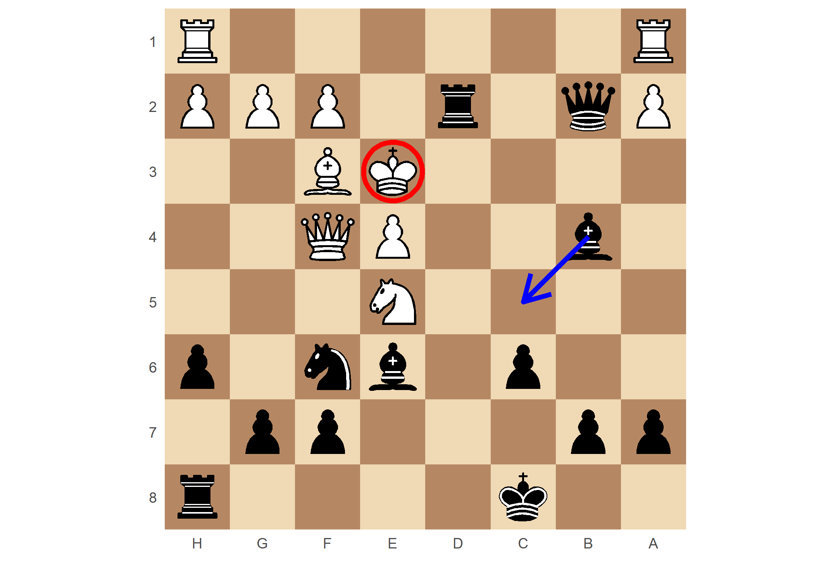
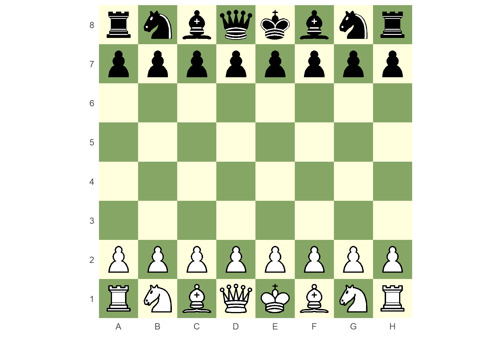

<!-- README.md is generated from README.Rmd. Please edit that file -->

# ggambit 

**This is a work in progress - please log any bugs found**

## Introduction

The aim of `ggambit` is to visualise Forsyth–Edwards Notation (FEN)
chess positions in R using `ggplot2`. Simple annotations (such as arrows
and circles) can also be added to the image by specifying standard chess
square notation (e4, c5, etc…).

As the plotting engine is `ggplot2`, any additional `ggplot2` layers may
be added to the image, giving the user full creative control.

### Attribution

Chess piece SVG design file downloaded from
<https://commons.wikimedia.org/wiki/File:Chess_Pieces_Sprite.svg>

  - jurgenwesterhof (adapted from work of Cburnett), CC BY-SA 3.0
    <https://creativecommons.org/licenses/by-sa/3.0>, via Wikimedia
    Commons

## Installation

`ggambit` can be installed from github

``` r
remotes::install_github('cj-holmes/ggambit')
```

``` r
library(ggambit)
```

## Plotting FEN positions

Visualise the FEN starting position using the default settings (from
white’s perspective)

``` r
plot_fen()
```



Use `add_arrow()`, `highlight_squares()`, `add_piece()`, `add_box()` and
`fade_board()` to include simple annotations specified by chess board
squares. These annotations are added to the plot in layers.

``` r
plot_fen() + add_arrow("e2", "e4") + highlight_squares(c("d5", "f5"))
```



``` r
plot_fen() + add_box("d4", "e5", fill="white", alpha=1/2) + add_arrow("c2", "c4")
```



### A more interesting example

``` r
my_fen <- "2k4r/pp3pp1/2p1bn1p/4N3/1b2PQ2/4KB2/Pq1r1PPP/R6R b - - 1 18"
```

``` r
plot_fen(my_fen) + add_arrow("b4", "c5") + highlight_squares("e3")
```



Change perspective with the `perspective` argument

``` r
plot_fen(my_fen, perspective = "b") + add_arrow("b4", "c5") + highlight_squares("e3")
```



## Board customisation

Square fill colours can be specified with the `palette` argument. An
attempt at a newspaper style can be set using `palette = "news"`. See
`plot_fen()` documentation for more details and options.

``` r
plot_fen(palette = "green")
```



``` r
plot_fen(palette = "news")
```


## Parsing PGN files

There is a new **experimental** (and slow\!) function for the parsing of
PGN files to a long-format dataframe `pgn_to_df()`. Currently this
function only works with raw (un-annotated) PGN files and **should be
used with extreme caution**.

Here I demonstrate using it to parse my own personal PGNs (from
[Lichess](https://lichess.org/)) and combining it with `plot_fen()` to
visualise where I move pieces to as a heat map.

Parse the PGN file

``` r
pgn_df <- pgn_to_df('tests/lichess_holmestorm_2021-01-03.pgn')
```

Visualise

``` r
library(ggplot2)
library(dplyr)

plot_fen(palette = c("white", "white"), show_coords = FALSE, border_col = 1)+
  fade_board(fade = 0.3)+
  ggnewscale::new_scale_fill()+
  geom_tile(data =
              pgn_df %>%
              filter(player == "holmestorm") %>%
              mutate(piece_moved = factor(piece_moved, levels = c("P", "B", "N", "R", "Q", "K"))) %>%
              count(colour, piece_moved, x, y) %>%
              group_by(colour, piece_moved) %>%
              mutate(t = sum(n),
                     p = 100 * (n/t)),
            aes(x, y, fill = p), alpha = 0.9)+
  facet_grid(colour ~ piece_moved)+
  scale_fill_viridis_c(option="viridis")+
  theme(legend.position = "bottom")+
  labs(title = "Where do I move my pieces to?",
       subtitle = "Facetted by piece [columns] and side (White/Black) [rows]",
       fill = "%",
       caption = "Data source: Lichess, Username: holmestorm")
```


